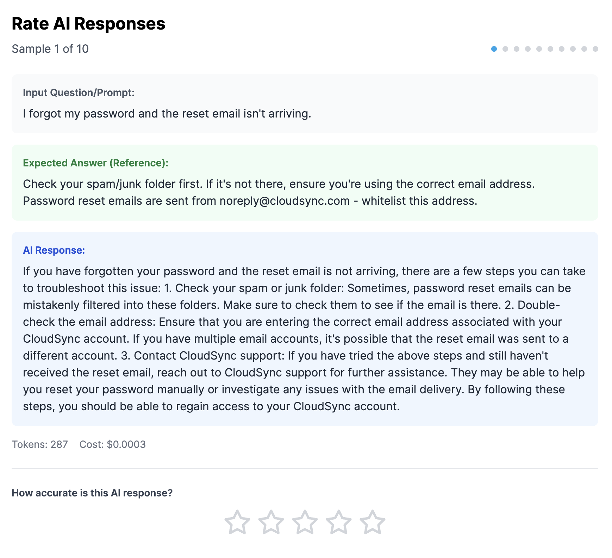
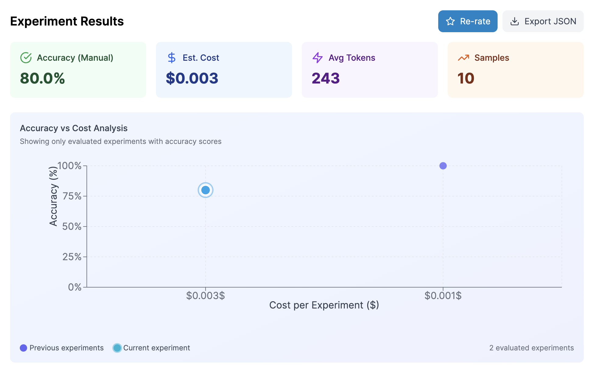
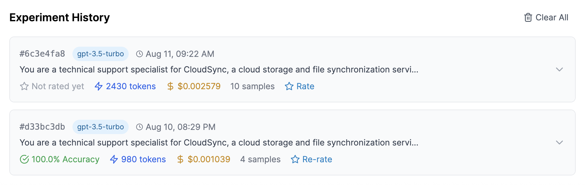

# Promptlyzer Lite

Open source prompt testing and evaluation platform for developers. Test your prompts across multiple LLMs, evaluate responses, and track costs - all running locally on your infrastructure.

## Quick Start

```bash
# Requires Docker Desktop installed
git clone https://github.com/Promptlyzer/promptlyzer-lite.git
cd promptlyzer-lite
docker-compose up -d

# Open http://localhost:3000
```

## Overview

Promptlyzer Lite is the open source version of Promptlyzer, designed to help developers and teams systematically test and evaluate LLM prompts. Perfect for local development, testing, and organizations that prefer self-hosted solutions. For advanced features and team collaboration, check out [Promptlyzer Cloud](https://promptlyzer.com).

## Screenshots

### LLM Result Rating

*Evaluate AI responses with a 5-star rating system. Track accuracy metrics across multiple test samples and identify the best performing prompts for your use case.*

### Experiment Results & Analysis

*Visualize the relationship between accuracy and cost across all your experiments. Identify the sweet spot where performance meets budget, helping you make data-driven decisions about model selection.*

### Experiment History

*Access complete history of all your prompt experiments with detailed metrics including response times, token usage, costs, and accuracy scores. Export results for further analysis or reporting.*

## Key Features

- **Multi-LLM Support**: Test prompts across 20+ models from OpenAI, Anthropic, and Together AI
- **Dataset Testing**: Upload JSON datasets to test prompts with multiple samples simultaneously
- **Manual Evaluation**: Rate AI responses with a 1-5 star system for quality assessment
- **Cost Tracking**: Real-time calculation of API costs across different providers
- **Experiment History**: Track all experiments with detailed metrics and results
- **Data Persistence**: All experiments stored in MongoDB for reliable data management
- **Self-Hosted**: Complete control over your data and infrastructure
- **API Key Management**: Secure local storage of API keys
- **Real-time Processing**: Asynchronous processing of multiple samples
- **Export Capabilities**: Export results as JSON for further analysis
- **Error Handling**: Comprehensive error handling with user-friendly messages

## Choose Your Edition

### Promptlyzer Lite (This Version)
Perfect for:
- Quick prompt testing and experimentation
- Local development and debugging
- Cost tracking across multiple LLMs
- Manual evaluation of AI responses
- Getting started with prompt testing

### Promptlyzer Cloud Developer
Ideal for:
- Professional developers
- Small teams (up to 5 users)
- Production deployments
- Advanced optimization needs

### Promptlyzer Cloud Enterprise
Designed for:
- Large organizations
- Unlimited team members
- Mission-critical applications
- Enterprise compliance requirements

### Promptlyzer Cloud Key Features:

**1. AI-Powered Optimization**
- Automatic prompt optimization with production-ready results
- Smart dataset generation from your data
- Multi-model A/B testing and benchmarking

**2. Intelligent Model Routing**
- Universal LLM Gateway for all providers
- Smart routing based on task requirements
- Real-time cost optimization across 20+ models

**3. Production Infrastructure**
- High-performance API with auto-scaling
- Prompt versioning with rollback
- Dev/staging/production pipelines

**4. Team Collaboration**
- Real-time collaboration on projects
- Role-based access control
- SSO/SAML authentication

**5. Enterprise Ready**
- SOC2 Type II certified
- Dedicated support
- Custom deployment options

### Feature Comparison

| Feature | Lite | Cloud Developer | Cloud Enterprise |
|---------|---------|-----------------|------------------|
| **AI-Powered Optimization** | - | ✓ | ✓ |
| **Accuracy Evaluation** | Manual | Automated | Automated |
| **Core Testing Features** | Basic | Advanced | Advanced |
| **Multi-LLM Support (20+ models)** | ✓ | ✓ | ✓ |
| **Smart Dataset Generation** | - | ✓ | ✓ |
| **Intelligent Model Routing** | - | ✓ | ✓ |
| **Universal LLM Gateway** | - | ✓ | ✓ |
| **Multi-Model A/B Testing** | - | ✓ | ✓ |
| **Prompt Versioning & Rollback** | - | ✓ | ✓ |
| **Dev/Staging/Prod Pipelines** | - | ✓ | ✓ |
| **Team Collaboration** | - | ✓ | ✓ |
| **SOC2 Certified** | - | - | ✓ |
| **Custom Deployment** | - | - | ✓ |
| **Support** | Community | Standard | Priority |
| **SLA Guarantee** | - | - | 99.9% |

**Ready to upgrade?** Experience the full power of Promptlyzer at [promptlyzer.com](https://promptlyzer.com)

## Supported Models

### OpenAI Models
- GPT-5 (OpenAI) *
- GPT-5-Mini (OpenAI) *
- GPT-5-Nano (OpenAI) *
- GPT-4o (OpenAI)
- GPT-4 Turbo (OpenAI)
- GPT-4 (OpenAI)
- GPT-3.5 Turbo (OpenAI)

### Anthropic Models
- Claude 3.5 Sonnet (Anthropic)
- Claude 3 Haiku (Anthropic)
- Claude 3 Opus (Anthropic)

### Together AI Models
- Llama 3.3 70B Turbo
- Llama 3.2 3B
- Llama 4 Scout
- Qwen 2.5 72B
- Qwen 2.5 7B
- DeepSeek V3
- DeepSeek R1 Qwen 1.5B
- Mixtral 8×7B
- Kimi K2 Instruct

> **Note:** GPT-5 models (*) require a verified organization account with OpenAI to access.

## Technology Stack

### Frontend
- React 18 with Vite for fast development
- Tailwind CSS for styling
- Recharts for data visualization
- React Hot Toast for notifications

### Backend
- FastAPI for high-performance API
- MongoDB for persistent data storage
- Pydantic for data validation
- Async/await for concurrent processing
- CORS support for secure cross-origin requests

## Prerequisites

### Option 1: Docker (Recommended)
- Docker and Docker Compose installed
- API keys for at least one LLM provider (OpenAI, Anthropic, or Together AI)

### Option 2: Manual Installation
- Node.js 18+ and npm/yarn
- Python 3.9+
- MongoDB 6+ (or use Docker for MongoDB only)
- API keys for at least one LLM provider

## Quick Start with Docker (Recommended)

### Prerequisites
- Docker Desktop installed ([Download here](https://www.docker.com/products/docker-desktop))
- Git installed

### Option 1: Using Launch Script (Easiest)
```bash
# Clone the repository
git clone https://github.com/Promptlyzer/promptlyzer-lite.git
cd promptlyzer-lite

# Run the launch script
chmod +x scripts/launch.sh
./scripts/launch.sh
```

The script will:
- Check Docker installation
- Create .env file from template
- Build and start all containers
- Show access URLs when ready

### Option 2: Manual Docker Compose
```bash
# Clone the repository
git clone https://github.com/Promptlyzer/promptlyzer-lite.git
cd promptlyzer-lite

# Copy environment variables
cp .env.example .env
# Edit .env and add your API keys

# Start all services
docker-compose up -d
```

### Step 2: Access the Application
Wait 30 seconds for services to start, then open:
- **Application**: http://localhost:3000
- **API Docs**: http://localhost:8000/docs
- **MongoDB**: localhost:27017 (if needed)

### Step 3: Configure API Keys
1. Open http://localhost:3000
2. Click "API Settings" button in header
3. Add your OpenAI/Anthropic/Together API keys
4. Start testing your prompts!

### Managing the Application
```bash
# View logs
docker-compose logs -f

# Stop services
docker-compose down

# Stop and clear all data
docker-compose down -v

# Restart services
docker-compose restart
```

## Manual Installation

### Clone the Repository

```bash
git clone https://github.com/Promptlyzer/promptlyzer-lite.git
cd promptlyzer-lite
```

### Backend Setup

```bash
cd backend
python -m venv venv
source venv/bin/activate  # On Windows: venv\Scripts\activate
pip install -r requirements.txt
```

### Frontend Setup

```bash
cd frontend
npm install
```

## Configuration

### Environment Variables

Create a `.env` file in the backend directory:

```env
# Optional: Set default API keys (can also be configured in UI)
OPENAI_API_KEY=your_openai_key_here
ANTHROPIC_API_KEY=your_anthropic_key_here
TOGETHER_API_KEY=your_together_key_here

# Server configuration
HOST=0.0.0.0
PORT=8000
```

### CORS Configuration

By default, the backend accepts requests from localhost:3000, localhost:3001, and localhost:5173. Modify `backend/app/config.py` to add additional origins if needed.

## Running the Application

### Start the Backend Server

```bash
cd backend
python -m uvicorn app.main:app --reload --port 8000
```

The API will be available at `http://localhost:8000`
API documentation is available at `http://localhost:8000/docs`

### Start the Frontend Development Server

```bash
cd frontend
npm run dev
```

The application will be available at `http://localhost:3000`

## Usage Guide

### 1. Configure API Keys
Click on "API Settings" in the header to configure your LLM provider API keys. Keys are stored locally in your browser.

### 2. Prepare Your Dataset
Create a JSON file with your test samples:

```json
{
  "qa_pairs": [
    {
      "question": "What is the capital of France?",
      "answer": "Paris"
    },
    {
      "question": "What is 2+2?",
      "answer": "4"
    }
  ],
  "system_context": "You are a helpful assistant."
}
```

### 3. Create an Experiment
- Upload your JSON dataset
- Write or modify the prompt template
- Select the LLM model to test
- Click "Run Experiment"

### 4. Evaluate Results
After the experiment completes:
- Review the responses
- Rate each response from 1-5 stars
- View aggregated accuracy metrics
- Export results as JSON

## Dataset Format

The application supports multiple JSON formats:

### Q&A Format
```json
{
  "qa_pairs": [
    {"question": "...", "answer": "..."}
  ],
  "system_context": "Optional system prompt"
}
```

### Simple Array Format
```json
[
  {"text": "Sample 1", "expected_answer": "Answer 1"},
  {"text": "Sample 2", "expected_answer": "Answer 2"}
]
```

### Text-Only Format
```json
{
  "samples": ["Text 1", "Text 2", "Text 3"]
}
```

## API Documentation

The FastAPI backend provides a comprehensive REST API. Access the interactive documentation at:
- Swagger UI: `http://localhost:8000/docs`
- ReDoc: `http://localhost:8000/redoc`

### Key Endpoints

- `POST /api/experiment` - Run a new experiment
- `GET /api/experiments` - List all experiments
- `GET /api/usage` - Get usage statistics
- `GET /health` - Health check endpoint

## Project Structure

```
promptlyzer-lite/
├── frontend/               # React frontend application
│   ├── src/
│   │   ├── components/    # React components
│   │   ├── services/      # API services
│   │   └── utils/         # Utility functions
│   └── package.json
├── backend/               # FastAPI backend application
│   ├── app/
│   │   ├── main.py       # Main application
│   │   ├── models.py     # Pydantic models
│   │   ├── config.py     # Configuration
│   │   ├── database.py   # MongoDB connection
│   │   └── llm_service.py # LLM integration
│   └── requirements.txt
├── docker-compose.yml     # Docker orchestration
└── README.md
```

## Development

### Running Tests

```bash
# Backend tests
cd backend
pytest

# Frontend tests
cd frontend
npm test
```

### Code Style

- Frontend: ESLint and Prettier configuration included
- Backend: Follow PEP 8 guidelines

### Building for Production

#### Frontend Build
```bash
cd frontend
npm run build
```

#### Backend Deployment
Use any ASGI server like Uvicorn or Gunicorn:
```bash
gunicorn app.main:app -w 4 -k uvicorn.workers.UvicornWorker
```

## Contributing

We welcome contributions! Please follow these steps:

1. Fork the repository
2. Create a feature branch (`git checkout -b feature/your-feature`)
3. Commit your changes (`git commit -m 'Add new feature'`)
4. Push to the branch (`git push origin feature/your-feature`)
5. Open a Pull Request

### Development Guidelines

- Write clear, descriptive commit messages
- Add tests for new features
- Update documentation as needed
- Follow existing code style and conventions

## Limitations

This open source version has some intentional limitations compared to the Pro version:
- Manual evaluation only (Pro includes automatic evaluation)
- Single model testing (Pro supports parallel multi-model testing)
- Basic analytics (Pro includes advanced statistical analysis)
- Local storage only (Pro includes cloud storage and team collaboration)

## Troubleshooting

### Common Issues

**CORS Errors**
- Ensure the frontend URL is added to `CORS_ORIGINS` in `backend/app/config.py`

**API Key Errors**
- Verify API keys are correctly configured in the UI
- Check API key permissions and quotas with your provider

**Port Conflicts**
- Change ports in the respective configuration files if defaults are in use

## Security Considerations

- API keys are stored in browser localStorage - use appropriate security measures
- Always run behind HTTPS in production
- Implement rate limiting for production deployments
- Regularly update dependencies for security patches

## License

MIT License - see [LICENSE](LICENSE) file for details

## Support

- **Issues**: Report bugs and request features via [GitHub Issues](https://github.com/Promptlyzer/promptlyzer-lite/issues)
- **Discussions**: Join our [GitHub Discussions](https://github.com/Promptlyzer/promptlyzer-lite/discussions)
- **Documentation**: Full documentation available at [docs.promptlyzer.com](https://docs.promptlyzer.com)


## Acknowledgments

Built with open source technologies and designed for the developer community. Special thanks to all contributors and early adopters who helped shape this project.

---

Made with dedication by the Promptlyzer team. If you find this project useful, please consider starring it on GitHub!